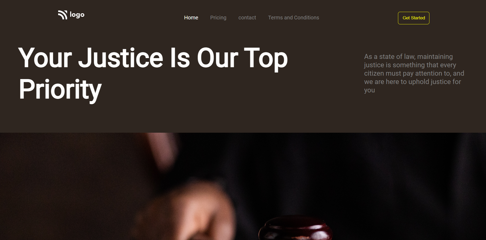

# project-03 #
[project-live](https://fswd-project3.netlify.app)
   - - - -
 # Technology used in this project #
     
    ___
* Skill Gained in this project
  * Learned to target elements using __:nth- child ,:first-child, :last child__
  *  Leaned to align the content using __align items__ and __justify content__
  * Learned to create button using __padding ,margin ,height , width__  and __border radius__
  * Learned about the position  __absolute__, __realtive__, etc.
   - - - -
 ## Time taken to complete this project ##
 * 4 hrs  to completed this poject
 
 ## Screenshot ##
 
 
